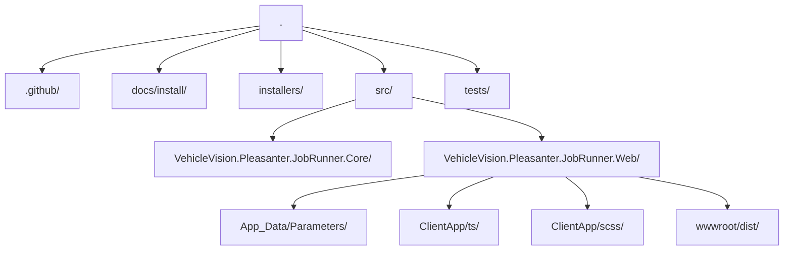

# VehicleVision.Pleasanter.JobRunner

VehicleVision.Pleasanter.JobRunner is a web application for managing C# and Python script execution within the same operational boundary as Pleasanter.

- ASP.NET Core 10 Razor Pages
- Hangfire + Hangfire.Console + Memory / SQL Server storage
- C# dynamic scripting via Roslyn
- Python external process execution
- Dapper based SQL Server / PostgreSQL / MySQL access
- TypeScript + Knockout.js binding
- SCSS + Bootstrap SCSS from npm
- AGPL-3.0-or-later

## Repository layout



## Build and test

Requirements:

- .NET SDK 10.0
- Node.js 24 or later
- npm
- Python, when Python script execution is used

```powershell
npm ci
npm run build
dotnet restore VehicleVision.Pleasanter.JobRunner.slnx
dotnet build VehicleVision.Pleasanter.JobRunner.slnx
dotnet test VehicleVision.Pleasanter.JobRunner.slnx
```

`dotnet build` also runs `npm run build` from the Web project, so generated assets stay in sync.

## Run locally

```powershell
dotnet run --project src/VehicleVision.Pleasanter.JobRunner.Web --urls http://localhost:5105
```

Open:

- Web UI: `http://localhost:5105`
- Hangfire dashboard: `http://localhost:5105/hangfire`

## Parameter sources

Base JSON files live under:

```text
src/VehicleVision.Pleasanter.JobRunner.Web/App_Data/Parameters/
```

`appsettings.json` is intentionally not used. Runtime settings can be supplied in this order:

1. `App_Data/Parameters/*.json`
2. User Secrets in development
3. Environment variables
4. Azure Web App Application settings, which are exposed as environment variables

Later sources override JSON values.

### Rds.json

```json
{
  "Dbms": "SQLServer",
  "UserConnectionString": "Server=localhost;Database=Implem.Pleasanter;Integrated Security=True;TrustServerCertificate=True;"
}
```

Supported `Dbms` values:

- `SQLServer`
- `PostgreSQL`
- `MySQL`

### HangfireRds.json

Hangfire storage uses memory by default. For production or multi-instance hosting, point Hangfire at a separate SQL Server database:

```json
{
  "Dbms": "SQLServer",
  "ConnectionString": "Server=localhost;Database=JobRunnerHangfire;Integrated Security=True;TrustServerCertificate=True;"
}
```

Use a separate database from Pleasanter's `Rds.json` so Hangfire tables and operational data stay isolated.

Supported `Dbms` values:

- `Memory`
- `SQLServer`

### JobRunner.json

```json
{
  "UsersAuthorizationCheckColumn": "CheckA",
  "GroupsAuthorizationCheckColumn": "CheckB",
  "DeptsAuthorizationCheckColumn": "CheckC",
  "PythonExecutablePath": "python",
  "AllowPlainTextPasswordHashForDevelopment": false
}
```

`AuthorizationCheckColumn` is still accepted as a backward-compatible fallback, but new deployments should use the table-specific settings.

## Environment variables

Use double underscores for nested keys:

```powershell
$env:JobRunner__Rds__Dbms = "SQLServer"
$env:JobRunner__Rds__UserConnectionString = "Server=localhost;Database=Implem.Pleasanter;Integrated Security=True;TrustServerCertificate=True;"
$env:JobRunner__HangfireRds__Dbms = "SQLServer"
$env:JobRunner__HangfireRds__ConnectionString = "Server=localhost;Database=JobRunnerHangfire;Integrated Security=True;TrustServerCertificate=True;"
$env:JobRunner__Authorization__UsersCheckColumn = "CheckA"
$env:JobRunner__Authorization__GroupsCheckColumn = "CheckB"
$env:JobRunner__Authorization__DeptsCheckColumn = "CheckC"
$env:JobRunner__PythonExecutablePath = "python"
```

Azure Web App uses the same names in App Service > Settings > Environment variables > App settings.

## User Secrets

The Web project has a `UserSecretsId`, so development secrets can be set without editing JSON files:

```powershell
dotnet user-secrets init --project src/VehicleVision.Pleasanter.JobRunner.Web
dotnet user-secrets set "JobRunner:Rds:Dbms" "PostgreSQL" --project src/VehicleVision.Pleasanter.JobRunner.Web
dotnet user-secrets set "JobRunner:Rds:UserConnectionString" "Host=localhost;Database=pleasanter;Username=pleasanter;Password=change-me" --project src/VehicleVision.Pleasanter.JobRunner.Web
dotnet user-secrets set "JobRunner:HangfireRds:Dbms" "SQLServer" --project src/VehicleVision.Pleasanter.JobRunner.Web
dotnet user-secrets set "JobRunner:HangfireRds:ConnectionString" "Server=localhost;Database=JobRunnerHangfire;Integrated Security=True;TrustServerCertificate=True;" --project src/VehicleVision.Pleasanter.JobRunner.Web
dotnet user-secrets set "JobRunner:Authorization:UsersCheckColumn" "CheckA" --project src/VehicleVision.Pleasanter.JobRunner.Web
dotnet user-secrets set "JobRunner:Authorization:GroupsCheckColumn" "CheckB" --project src/VehicleVision.Pleasanter.JobRunner.Web
dotnet user-secrets set "JobRunner:Authorization:DeptsCheckColumn" "CheckC" --project src/VehicleVision.Pleasanter.JobRunner.Web
```

## Frontend development

Source files:

- TypeScript: `src/VehicleVision.Pleasanter.JobRunner.Web/ClientApp/ts/app.ts`
- SCSS: `src/VehicleVision.Pleasanter.JobRunner.Web/ClientApp/scss/site.scss`

Build:

```powershell
npm run build
npx tsc --noEmit
npm run audit
```

The Razor layout references only:

- `wwwroot/dist/site.css`
- `wwwroot/dist/app.js`

## Authentication and authorization

Authentication uses Pleasanter `Users.LoginId` and `Users.PasswordHash`.

Authorization is hierarchical:

1. allow when `Users.<UsersAuthorizationCheckColumn>` is true;
2. otherwise allow when any joined `Groups.<GroupsAuthorizationCheckColumn>` is true;
3. otherwise allow when `Depts.<DeptsAuthorizationCheckColumn>` is true;
4. otherwise deny.

## CI and dependency maintenance

GitHub Actions runs:

- `npm ci`
- `npm run build`
- `npx tsc --noEmit`
- `npm run audit`
- `dotnet restore/build/test`
- `dotnet list package --vulnerable --include-transitive`

Dependabot is configured for NuGet, npm, and GitHub Actions.

## Installation docs

See [docs/install](docs/install/README.md):

- Windows Server + IIS
- Debian
- Ubuntu
- AlmaLinux
- Azure Web App
- Installer strategy

## License

This project is licensed under `AGPL-3.0-or-later`. See [LICENSE](LICENSE).

Because this is a network application, modified versions offered over a network must provide corresponding source code as required by AGPL section 13.

## Security notes

JobRunner executes arbitrary C# and Python code on the server. Deploy it only for trusted administrators and inside the same operational boundary as the Pleasanter instance it manages.

Hangfire uses memory storage by default. Configure `HangfireRds.json` or `JobRunner__HangfireRds__...` with a separate SQL Server database before multi-instance production deployment.
