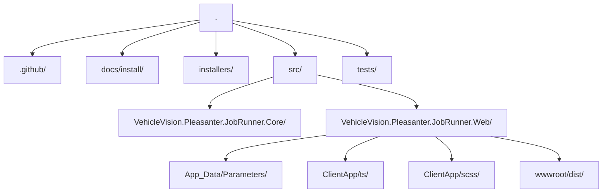

# VehicleVision.Pleasanter.JobRunner

言語: 日本語 | [English](README.en.md)

VehicleVision.Pleasanter.JobRunner は、Pleasanter と同じ運用領域に配置して使う、C# / Python / ClearScript(JavaScript) スクリプトの実行を管理する Web アプリケーションです。

- ASP.NET Core 10 Razor Pages
- Hangfire + Hangfire.Console + メモリ / SQL Server / PostgreSQL ストレージ
- Roslyn による C# 動的スクリプト実行
- 外部プロセスとしての Python 実行
- ClearScript/V8 による JavaScript 実行
- Dapper による SQL Server / PostgreSQL / MySQL 接続
- TypeScript + Knockout.js
- npm から取得した Bootstrap SCSS によるスタイルビルド
- AGPL-3.0-or-later

## リポジトリ構成



## ビルドとテスト

必要なもの:

- .NET SDK 10.0
- Node.js 24 以降
- npm
- Python スクリプトを実行する場合は Python

```powershell
npm ci
npm run build
dotnet restore VehicleVision.Pleasanter.JobRunner.slnx
dotnet build VehicleVision.Pleasanter.JobRunner.slnx
dotnet test VehicleVision.Pleasanter.JobRunner.slnx
```

`dotnet build` は Web プロジェクトから `npm run build` も実行します。そのため、生成済みの静的ファイルも同時に更新されます。

## ローカル実行

```powershell
dotnet run --project src/VehicleVision.Pleasanter.JobRunner.Web --urls http://localhost:5105
```

起動後に次の URL を開きます。

- Web 画面: `http://localhost:5105`
- Hangfire ダッシュボード: `http://localhost:5105/hangfire`

## パラメーターの読み込み

基本の JSON ファイルは次の場所に配置します。

```text
src/VehicleVision.Pleasanter.JobRunner.Web/App_Data/Parameters/
```

`appsettings.json` は意図的に使いません。実行時設定は次の順序で読み込まれます。

1. `App_Data/Parameters/*.json`
2. 開発環境の User Secrets
3. 環境変数
4. 環境変数として公開される Azure Web App のアプリケーション設定

後に読み込まれる設定ほど優先され、JSON の値を上書きします。

### Rds.json

```json
{
  "Dbms": "SQLServer",
  "UserConnectionString": "Server=localhost;Database=Implem.Pleasanter;Integrated Security=True;TrustServerCertificate=True;"
}
```

指定できる `Dbms`:

- `SQLServer`
- `PostgreSQL`
- `MySQL`

### HangfireRds.json

Hangfire のストレージは、既定ではメモリを使います。本番環境や複数インスタンス構成では、Hangfire 専用の SQL Server または PostgreSQL データベースを指定してください。

```json
{
  "Dbms": "SQLServer",
  "ConnectionString": "Server=localhost;Database=JobRunnerHangfire;Integrated Security=True;TrustServerCertificate=True;"
}
```

PostgreSQL の例:

```json
{
  "Dbms": "PostgreSQL",
  "ConnectionString": "Host=localhost;Database=jobrunner_hangfire;Username=jobrunner;Password=change-me"
}
```

Hangfire のテーブルや運用データを分離するため、Pleasanter 用の `Rds.json` とは別のデータベースを使ってください。

指定できる `Dbms`:

- `Memory`
- `SQLServer`
- `PostgreSQL`

`MySQL` は、このプロジェクトの Hangfire ストレージとしてはサポートしていません。Pleasanter へのデータアクセスでは、`Rds.json` 経由で引き続き MySQL を使用できます。

### JobRunner.json

```json
{
  "UsersAuthorizationCheckColumn": "CheckA",
  "GroupsAuthorizationCheckColumn": "CheckB",
  "DeptsAuthorizationCheckColumn": "CheckC",
  "PythonExecutablePath": "python",
  "AllowPlainTextPasswordHashForDevelopment": false
}
```

`AuthorizationCheckColumn` は後方互換用の代替設定として引き続き受け付けます。ただし、新しい環境ではテーブルごとの設定を使ってください。

### ClearScript ホスト API

ClearScript は V8 JavaScript として実行され、Pleasanter のサーバスクリプトに近い感覚で使える簡易ホスト API を公開します。完全互換ではありません。

```javascript
context.log("hello");
console.warn({ jobName: context.jobName });
const users = items.where("Users", "LoginId", "admin", 10);
```

利用できる主なメソッド:

- `console.log/info/warn/error(...)`
- `context.log/info/warn/error(...)`, `context.jobName`, `context.language`, `context.now()`
- `items.get(tableName, keyColumnName, keyValue)`
- `items.where(tableName, columnName, value, limit)`
- `items.query(sql, parameters)`, `items.execute(sql, parameters)`
- `items.update(tableName, keyColumnName, keyValue, values)`, `items.insert(tableName, values)`

`items` は `Rds.json` の Pleasanter DB 接続を使います。テーブル名・カラム名は単純な識別子のみ受け付け、値はパラメーター化されます。`items.query` と `items.execute` は SQL をそのまま実行するため、信頼できる管理者だけが使ってください。

## 環境変数

階層化されたキーには 2 つのアンダースコアを使います。

```powershell
$env:JobRunner__Rds__Dbms = "SQLServer"
$env:JobRunner__Rds__UserConnectionString = "Server=localhost;Database=Implem.Pleasanter;Integrated Security=True;TrustServerCertificate=True;"
$env:JobRunner__HangfireRds__Dbms = "SQLServer"
$env:JobRunner__HangfireRds__ConnectionString = "Server=localhost;Database=JobRunnerHangfire;Integrated Security=True;TrustServerCertificate=True;"
$env:JobRunner__Authorization__UsersCheckColumn = "CheckA"
$env:JobRunner__Authorization__GroupsCheckColumn = "CheckB"
$env:JobRunner__Authorization__DeptsCheckColumn = "CheckC"
$env:JobRunner__PythonExecutablePath = "python"
```

Azure Web App でも、App Service > Settings > Environment variables > App settings に同じ名前で設定します。

## User Secrets

Web プロジェクトには `UserSecretsId` が設定されています。開発用の秘密情報は、JSON ファイルを編集せずに User Secrets へ保存できます。

```powershell
dotnet user-secrets init --project src/VehicleVision.Pleasanter.JobRunner.Web
dotnet user-secrets set "JobRunner:Rds:Dbms" "PostgreSQL" --project src/VehicleVision.Pleasanter.JobRunner.Web
dotnet user-secrets set "JobRunner:Rds:UserConnectionString" "Host=localhost;Database=pleasanter;Username=pleasanter;Password=change-me" --project src/VehicleVision.Pleasanter.JobRunner.Web
dotnet user-secrets set "JobRunner:HangfireRds:Dbms" "SQLServer" --project src/VehicleVision.Pleasanter.JobRunner.Web
dotnet user-secrets set "JobRunner:HangfireRds:ConnectionString" "Server=localhost;Database=JobRunnerHangfire;Integrated Security=True;TrustServerCertificate=True;" --project src/VehicleVision.Pleasanter.JobRunner.Web
dotnet user-secrets set "JobRunner:Authorization:UsersCheckColumn" "CheckA" --project src/VehicleVision.Pleasanter.JobRunner.Web
dotnet user-secrets set "JobRunner:Authorization:GroupsCheckColumn" "CheckB" --project src/VehicleVision.Pleasanter.JobRunner.Web
dotnet user-secrets set "JobRunner:Authorization:DeptsCheckColumn" "CheckC" --project src/VehicleVision.Pleasanter.JobRunner.Web
```

## フロントエンド開発

ソースファイル:

- TypeScript: `src/VehicleVision.Pleasanter.JobRunner.Web/ClientApp/ts/app.ts`
- SCSS: `src/VehicleVision.Pleasanter.JobRunner.Web/ClientApp/scss/site.scss`

ビルド:

```powershell
npm run build
npx tsc --noEmit
npm run audit
```

Razor レイアウトは、次の生成済みファイルだけを参照します。

- `wwwroot/dist/site.css`
- `wwwroot/dist/app.js`

## 認証と認可

認証には Pleasanter の `Users.LoginId` と `Users.PasswordHash` を使います。

認可は次の順序で判定します。

1. `Users.<UsersAuthorizationCheckColumn>` が true なら許可する。
2. そうでなければ、結合された `Groups.<GroupsAuthorizationCheckColumn>` のいずれかが true なら許可する。
3. そうでなければ、`Depts.<DeptsAuthorizationCheckColumn>` が true なら許可する。
4. それ以外は拒否する。

## CI と依存関係メンテナンス

GitHub Actions では次の処理を実行します。

- `npm ci`
- `npm run build`
- `npx tsc --noEmit`
- `npm run audit`
- `dotnet restore/build/test`
- `dotnet list package --vulnerable --include-transitive`

Dependabot は NuGet、npm、GitHub Actions 用に設定されています。

## インストールガイド

[docs/install](docs/install/README.md) を参照してください。

- Windows Server + IIS
- Debian
- Ubuntu
- AlmaLinux
- Azure Web App
- インストーラー方針

## ライセンス

このプロジェクトは `AGPL-3.0-or-later` でライセンスされています。詳しくは [LICENSE](LICENSE) を参照してください。

このアプリケーションを改変してネットワーク越しに提供する場合、AGPL 第 13 条に従い、対応するソースコードを提供する必要があります。

## セキュリティメモ

JobRunner は、サーバー上で任意の C# / Python / ClearScript(JavaScript) コードを実行します。信頼できる管理者だけが使えるようにし、管理対象の Pleasanter インスタンスと同じ運用境界の内側に配置してください。

Hangfire は既定ではメモリストレージを使います。複数インスタンス構成の本番環境で使う前に、`HangfireRds.json` または `JobRunner__HangfireRds__...` で Hangfire 専用の SQL Server または PostgreSQL データベースを設定してください。MySQL は、このプロジェクトの Hangfire ストレージとしては意図的にサポートしていません。
